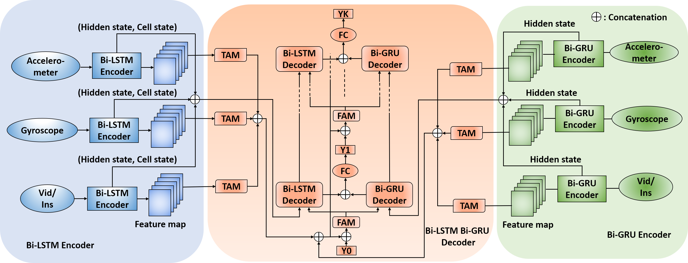

# Predicting Lower Extremity Joint Kinematics Using Multi-Modal Data in the Lab and Outdoor Environment
By: Md Sanzid Bin Hossain, Zhishan Guo, Ning Sui, Hwan Choi

## Summary

This repository contains the code and models developed for predicting future walking joint kinematics, which is crucial for the real-time control of assistive devices such as exoskeletons and lower limb prostheses. Traditional methods like optical motion capture and IMU-based systems face challenges such as post-processing delays and data collection lag, making real-time prediction difficult. Our approach leverages the **Dual-ED-Attention-FAM-Net**, a deep learning model that incorporates two encoders, two decoders, a temporal attention module, and a feature attention module to effectively predict future kinematics.

### Key Features:
- **State-of-the-Art Performance**: Our model outperforms existing LSTM models in predicting joint kinematics.
- **Multimodal Data Integration**: Incorporates data from IMUs, videos, and pressure insoles to enhance prediction accuracy.
- **Improved RMSE**: Significant reductions in Root Mean Square Error (RMSE) across different datasets:
  - **Dataset A**: IMUs-only RMSE decreased from **4.45°** to **4.22°**; IMUs + videos RMSE decreased from **4.52°** to **4.15°**.
  - **Dataset B**: IMUs-only RMSE decreased from **7.09°** to **6.66°**; IMUs + pressure insoles RMSE decreased from **7.20°** to **6.77°**.

### Why It Matters:
By predicting future kinematics, our model compensates for delays in data processing, enabling real-time control of assistive devices and providing more accurate target trajectories for exoskeletons and prostheses, even in variable walking environments.

Explore the code and models to implement this advanced solution for enhancing real-time control in assistive devices.

 

## Model architecture

Entire structure of Dual-ED-Attention-FAM-Net. It has a Temporal Attention Module (TAM), Feature Attention Module (FAM), and Fully Connected (FC) layer. For Dataset A, we use video data from legs, where in Dataset B, we utilize pressure data from foot insoles.

 

## Dataset

- **Dataset A**[1] can be downloaded from the [google drive link](https://drive.google.com/file/d/1TAb1LAEt8EMMI5herwQd4T3f__2TWIMe/view?usp=drive_link)
- **Dataset B**[2] can be downloaded from the [google drive link](https://drive.google.com/file/d/17EKrzZxoqofL8vzS0g3gZ1EdGdmVSQRK/view?usp=sharing)

 

## Codes
- [Google Colab notebook](HICCS_Dataset_A_Kinematics_prediction.ipynb) to run the model for **Dataset A**.
- [Google Colab notebook](HICCS_Dataset_B_Kinematics_prediction.ipynb) to run the model for **Dataset B**.

 

## References
[1] Md Moniruzzaman, Zhaozheng Yin, Md Sanzid Bin Hossain, Hwan Choi, and Zhishan Guo, “Wearable Motion Capture: Reconstructing and Predicting 3D Human Poses From Wearable Sensors,” IEEE Journal of Biomedical and Health Informatics, vol. 27, no. 11, pp. 5345–5356, 2023.

[2] Losing, V., & Hasenj¨ager, M. (2022). A multi-modal gait database of natural everyday-walk in an urban environment. Scientific data, 9(1), 473

